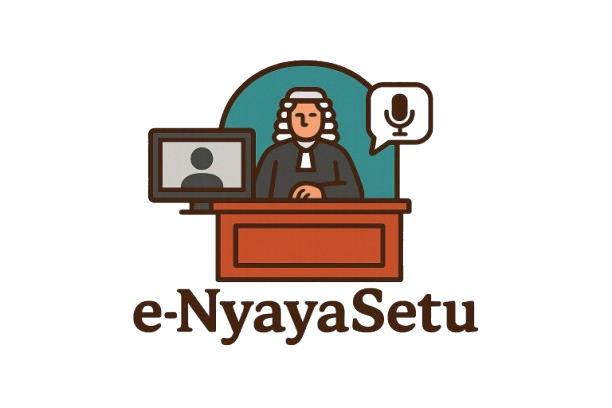

# ⚖️ eNyayaSetu - Digital Bridge of Justice

<div align="center">



**AI-Powered Virtual Courtroom Platform for Accessible Justice**

[](https://reactjs.org/)
[](https://www.typescriptlang.org/)
[](https://supabase.com/)
[](https://tailwindcss.com/)

</div>

---

## 📋 Table of Contents

- [Overview](#-overview)
- [Key Features](#-key-features)
- [Tech Stack](#-tech-stack)
- [System Architecture](#-system-architecture)
- [Use Cases](#-use-cases)
- [Project Structure](#-project-structure)
- [Edge Functions](#-edge-functions)
- [Database Schema](#-database-schema)
- [Getting Started](#-getting-started)
- [Configuration](#-configuration)

---

## 🌟 Overview

**eNyayaSetu** (meaning "Digital Bridge of Justice" in Hindi) is an AI-powered virtual courtroom platform designed to make legal proceedings accessible to everyone. The platform enables users to:

- 📄 Upload and process legal documents (FIR, SIR, FR) with OCR
- 🎤 Use voice input with multilingual support (English, Hindi, Hinglish)
- 👤 Verify identity through AI-powered face detection
- ⚖️ Participate in virtual court hearings with AI-assisted proceedings
- 📊 Track case progress and receive AI-generated analysis

---

## ✨ Key Features

### 🔍 Intelligent Document Processing
```
┌─────────────────────────────────────────────────────────┐
│                   OCR Document Analysis                 │
├─────────────────────────────────────────────────────────┤
│  📎 Upload PDF/Image  ──▶  🔍 AI OCR Processing        │
│                             │                           │
│                             ▼                           │
│  📋 Extract:                                           │
│     • Case Number                                       │
│     • Parties (Complainant/Accused)                     │
│     • Sections Invoked                                  │
│     • Case Summary                                      │
│                             │                           │
│                             ▼                           │
│  🔄 Duplicate Detection  ──▶  ✅ Proceed or Link       │
└─────────────────────────────────────────────────────────┘
```

### 🎤 Multilingual Voice Recognition
```
┌─────────────────────────────────────────────────────────┐
│              ElevenLabs Speech-to-Text                  │
├─────────────────────────────────────────────────────────┤
│  Supported Languages:                                   │
│  ├── 🇬🇧 English (en)                                   │
│  ├── 🇮🇳 Hindi (hi)                                     │
│  └── 🇮🇳🇬🇧 Hinglish (hi-en)                             │
│                                                         │
│  Features:                                              │
│  ├── Real-time transcription                           │
│  ├── Partial transcript display                        │
│  └── Web Speech API fallback                           │
└─────────────────────────────────────────────────────────┘
```

### 👁️ AI Face Detection & Verification
```
┌─────────────────────────────────────────────────────────┐
│            TensorFlow.js Face Detection                 │
├─────────────────────────────────────────────────────────┤
│  Step 1: Upload ID Document                             │
│     ├── 📄 Aadhar Card                                  │
│     ├── 🚗 Driving License                              │
│     └── 🛂 Passport                                     │
│                     │                                   │
│                     ▼                                   │
│  Step 2: Live Selfie with Face Detection               │
│     ├── 📸 Real-time face box overlay                   │
│     ├── 📊 Confidence score (min 70%)                   │
│     └── 🔍 Continuous detection                         │
│                     │                                   │
│                     ▼                                   │
│  Step 3: Video Verification (3-5 seconds)              │
│     └── 🎥 Backend team review                          │
└─────────────────────────────────────────────────────────┘
```

### ⚖️ Virtual Courtroom
```
┌─────────────────────────────────────────────────────────┐
│              Virtual Court Hearing                      │
├─────────────────────────────────────────────────────────┤
│                                                         │
│  Roles Supported:                                       │
│  ├── 👨‍⚖️ Judge                                          │
│  ├── 👔 Public Prosecutor                               │
│  ├── 👨‍💼 Defence Lawyer                                 │
│  ├── ✍️ Stenographer                                    │
│  ├── 👤 Accused / Victim                                │
│  ├── 👨‍👩‍👧 Family Members                                 │
│  ├── 👮 Police Staff                                    │
│  └── 👥 Audience                                        │
│                                                         │
│  Features:                                              │
│  ├── 🎭 Role-based AI responses                         │
│  ├── 📝 Real-time transcription                         │
│  ├── 📅 Adjournment requests                            │
│  └── 📊 Evidence presentation                           │
└─────────────────────────────────────────────────────────┘
```

---

## 🛠️ Tech Stack

| Category | Technology |
|----------|------------|
| **Frontend** | React 18, TypeScript, Vite |
| **Styling** | TailwindCSS, shadcn/ui |
| **Backend** | Express.js, MySQL |
| **Database** | MySQL |
| **AI/ML** | face-api.js (TensorFlow.js), AI Gateway (Gemini/GPT-4) |
| **Voice** | ElevenLabs STT, Web Speech API |
| **Storage** | Supabase Storage |
| **Auth** | Supabase Auth |

---

## 🏗️ System Architecture

```
┌────────────────────────────────────────────────────────────────────┐
│                         CLIENT (React SPA)                          │
├────────────────────────────────────────────────────────────────────┤
│                                                                    │
│  ┌──────────────┐  ┌──────────────┐  ┌──────────────────────────┐ │
│  │   Pages      │  │  Components  │  │        Hooks             │ │
│  │ ─────────    │  │ ─────────    │  │ ─────────────            │ │
│  │ • Index      │  │ • HeroSection│  │ • useAuth                │ │
│  │ • Auth       │  │ • CaseIntake │  │ • useElevenLabsSTT       │ │
│  │ • Admin      │  │ • CourtHear  │  │ • useFaceDetection       │ │
│  │ • NotFound   │  │ • Identity   │  │ • useVoiceControls       │ │
│  └──────────────┘  │ • Evidence   │  │ • useLanguage            │ │
│                    └──────────────┘  └──────────────────────────┘ │
│                                                                    │
└────────────────────────────────────────────────────────────────────┘
                                 │
                                 │ HTTPS / WebSocket
                                 ▼
┌────────────────────────────────────────────────────────────────────┐
│                      SUPABASE EDGE FUNCTIONS                        │
├────────────────────────────────────────────────────────────────────┤
│                                                                    │
│  ┌─────────────────┐  ┌─────────────────┐  ┌────────────────────┐ │
│  │ case-intake-chat│  │ court-chat      │  │ analyze-evidence   │ │
│  │ ───────────────│  │ ───────────────  │  │ ────────────────   │ │
│  │ AI-guided case │  │ Role-based court │  │ Legal evidence     │ │
│  │ filing process │  │ proceedings AI   │  │ analysis           │ │
│  └─────────────────┘  └─────────────────┘  └────────────────────┘ │
│                                                                    │
│  ┌─────────────────┐  ┌─────────────────┐  ┌────────────────────┐ │
│  │ ocr-document    │  │check-duplicate  │  │ text-to-speech     │ │
│  │ ───────────────│  │ ───────────────  │  │ ────────────────   │ │
│  │ Extract text &  │  │ Find existing   │  │ Voice output for   │ │
│  │ legal info      │  │ similar cases   │  │ court proceedings  │ │
│  └─────────────────┘  └─────────────────┘  └────────────────────┘ │
│                                                                    │
│  ┌─────────────────────────────────────────────────────────────┐  │
│  │                  elevenlabs-scribe-token                     │  │
│  │  Generate secure tokens for ElevenLabs real-time STT        │  │
│  └─────────────────────────────────────────────────────────────┘  │
│                                                                    │
└────────────────────────────────────────────────────────────────────┘
                                 │
                                 ▼
┌────────────────────────────────────────────────────────────────────┐
│                      SUPABASE SERVICES                              │
├────────────────────────────────────────────────────────────────────┤
│                                                                    │
│  ┌──────────────┐  ┌──────────────┐  ┌──────────────────────────┐ │
│  │  PostgreSQL  │  │   Storage    │  │      Auth                │ │
│  │ ──────────── │  │ ──────────── │  │ ────────────             │ │
│  │ • cases      │  │ • evidence   │  │ • Email/Password         │ │
│  │ • evidence   │  │ • voice-rec  │  │ • User Sessions          │ │
│  │ • transcripts│  │ • knowledge  │  │ • Role Management        │ │
│  │ • profiles   │  │              │  │                          │ │
│  │ • user_roles │  │              │  │                          │ │
│  └──────────────┘  └──────────────┘  └──────────────────────────┘ │
│                                                                    │
└────────────────────────────────────────────────────────────────────┘
                                 │
                                 ▼
┌────────────────────────────────────────────────────────────────────┐
│                      EXTERNAL SERVICES                              │
├────────────────────────────────────────────────────────────────────┤
│  ┌──────────────┐  ┌──────────────────────────────────────────┐   │
│  │  ElevenLabs  │  │         AI Gateway Service              │   │
│  │ ──────────── │  │ ────────────────────────────             │   │
│  │ • STT API    │  │ • Gemini 2.5 Flash (OCR, Analysis)       │   │
│  │ • TTS API    │  │ • GPT-4 (Complex reasoning)              │   │
│  │              │  │ • Multi-model routing                    │   │
│  └──────────────┘  └──────────────────────────────────────────┘   │
└────────────────────────────────────────────────────────────────────┘
```

---

## 📌 Use Cases

### 1️⃣ Citizen Filing a New Case
```
User Journey:
━━━━━━━━━━━━━━━━━━━━━━━━━━━━━━━━━━━━━━━━━━━━━━━━━━━━━━━━━━━━━━━━━━━━

📱 Open App → 📋 Select "File New Case" → 📄 Upload FIR/SIR/FR
                                              │
                                              ▼
                                    🔍 OCR extracts case details
                                              │
                            ┌─────────────────┴─────────────────┐
                            ▼                                   ▼
                    🔄 Duplicate Found?                 ✅ New Case
                            │                                   │
                    ├── Add to existing                         │
                    └── Create new anyway                       │
                                                               ▼
                                            👤 Identity Verification
                                                (ID + Selfie + Video)
                                                               │
                                                               ▼
                                            💬 AI Intake Chat (details)
                                                               │
                                                               ▼
                                            ✅ Case Registered
                                            📞 Callback scheduled
```

### 2️⃣ Virtual Court Hearing
```
Hearing Flow:
━━━━━━━━━━━━━━━━━━━━━━━━━━━━━━━━━━━━━━━━━━━━━━━━━━━━━━━━━━━━━━━━━━━━

🔐 Login → 👤 Select Role → ⚖️ Enter Courtroom
                                    │
                    ┌───────────────┼───────────────┐
                    ▼               ▼               ▼
            👨‍⚖️ As Judge    👔 As Prosecutor   👨‍💼 As Defence
                    │               │               │
                    └───────────────┼───────────────┘
                                    ▼
                        🎤 Voice Input (Multilingual)
                        📝 Real-time Transcription
                        🤖 AI-Assisted Responses
                                    │
                                    ▼
                        📊 Evidence Presentation
                        📅 Adjournment Requests
                        📜 Verdict Delivery
```

### 3️⃣ Evidence Analysis
```
Evidence Flow:
━━━━━━━━━━━━━━━━━━━━━━━━━━━━━━━━━━━━━━━━━━━━━━━━━━━━━━━━━━━━━━━━━━━━

📎 Upload Evidence → 🔍 AI Analysis → 📋 Legal Relevance Report
        │                   │                    │
        ▼                   ▼                    ▼
   Supported:         Extracts:            Generates:
   • Documents        • Key information    • Relevance assessment
   • Images           • Dates & parties    • Legal implications
   • PDFs             • Section numbers    • Recommendations
```

---

## 📁 Project Structure

```
eNyayaSetu/
├── 📂 src/
│   ├── 📂 assets/
│   │   └── 🖼️ logo.png
│   │
│   ├── 📂 components/
│   │   ├── 📂 admin/
│   │   │   ├── CaseDetailModal.tsx
│   │   │   ├── LogsViewer.tsx
│   │   │   └── UsageStats.tsx
│   │   ├── 📂 ui/              # shadcn/ui components
│   │   │   ├── button.tsx
│   │   │   ├── card.tsx
│   │   │   ├── dialog.tsx
│   │   │   └── ...40+ components
│   │   ├── CaseCard.tsx
│   │   ├── CaseIntakeChat.tsx     # 💬 AI case filing chat
│   │   ├── CaseSelection.tsx
│   │   ├── CharacterAvatar.tsx
│   │   ├── CourtHearing.tsx       # ⚖️ Virtual courtroom
│   │   ├── CourtroomScene.tsx
│   │   ├── CustomCaseForm.tsx
│   │   ├── DateRequestModal.tsx
│   │   ├── EvidenceUpload.tsx     # 📎 Evidence management
│   │   ├── HeroSection.tsx
│   │   ├── IdentityVerification.tsx # 👤 Face detection
│   │   ├── KnowledgeBaseUpload.tsx
│   │   ├── LanguageModal.tsx      # 🌐 i18n support
│   │   ├── NavLink.tsx
│   │   ├── RoleSelectionModal.tsx
│   │   ├── SpeechBubble.tsx
│   │   └── VoiceControls.tsx      # 🎤 Voice input
│   │
│   ├── 📂 contexts/
│   │   └── LanguageContext.tsx    # 🌐 Language state
│   │
│   ├── 📂 data/
│   │   └── exampleCases.ts        # Sample case data
│   │
│   ├── 📂 hooks/
│   │   ├── use-mobile.tsx
│   │   ├── use-toast.ts
│   │   ├── useAuth.ts             # 🔐 Authentication
│   │   ├── useElevenLabsSTT.ts    # 🎤 Voice recognition
│   │   ├── useFaceDetection.ts    # 👁️ Face detection
│   │   └── useVoiceControls.ts    # 🎤 Voice management
│   │
│   ├── 📂 integrations/
│   │   └── 📂 supabase/
│   │       ├── client.ts          # Supabase client
│   │       └── types.ts           # Database types
│   │
│   ├── 📂 pages/
│   │   ├── Admin.tsx              # 👨‍💼 Admin dashboard
│   │   ├── Auth.tsx               # 🔐 Login/Register
│   │   ├── Index.tsx              # 🏠 Main app
│   │   └── NotFound.tsx           # 404 page
│   │
│   ├── 📂 types/
│   │   └── court.ts               # TypeScript types
│   │
│   ├── App.tsx
│   ├── App.css
│   ├── index.css                  # Tailwind + design tokens
│   └── main.tsx
│
├── 📂 supabase/
│   ├── 📂 functions/
│   │   ├── 📂 analyze-evidence/   # Evidence AI analysis
│   │   ├── 📂 case-intake-chat/   # Case filing AI
│   │   ├── 📂 check-duplicate-case/ # Duplicate detection
│   │   ├── 📂 court-chat/         # Courtroom AI
│   │   ├── 📂 elevenlabs-scribe-token/ # STT tokens
│   │   ├── 📂 ocr-document/       # Document OCR
│   │   └── 📂 text-to-speech/     # TTS service
│   │
│   └── config.toml                # Supabase config
│
├── 📄 index.html
├── 📄 tailwind.config.ts
├── 📄 vite.config.ts
└── 📄 package.json
```

---

## 🔌 Edge Functions

| Function | Purpose | AI Model |
|----------|---------|----------|
| `case-intake-chat` | Guides users through case filing | Gemini 2.5 Flash |
| `court-chat` | Role-based courtroom AI responses | Gemini 2.5 Flash |
| `analyze-evidence` | Analyzes uploaded evidence | Gemini 2.5 Flash |
| `ocr-document` | Extracts text from legal documents | Gemini 2.5 Flash |
| `check-duplicate-case` | Finds existing similar cases | PostgreSQL queries |
| `elevenlabs-scribe-token` | Generates STT access tokens | ElevenLabs API |
| `text-to-speech` | Converts text to speech | ElevenLabs API |

---

## 🗄️ Database Schema

```
┌─────────────────────────────────────────────────────────────────────┐
│                         DATABASE TABLES                              │
├─────────────────────────────────────────────────────────────────────┤
│                                                                     │
│  ┌─────────────────┐         ┌─────────────────────────────────┐   │
│  │     cases       │         │      case_evidence              │   │
│  │ ─────────────── │         │ ─────────────────────────       │   │
│  │ id (PK)         │◄────────│ case_id (FK)                    │   │
│  │ user_id         │         │ file_name, file_url             │   │
│  │ case_number     │         │ provided_by (enum)              │   │
│  │ title           │         │ ai_analysis                     │   │
│  │ plaintiff       │         └─────────────────────────────────┘   │
│  │ defendant       │                                               │
│  │ status (enum)   │         ┌─────────────────────────────────┐   │
│  │ verdict         │         │    hearing_sessions             │   │
│  │ user_role       │◄────────│ ─────────────────────────       │   │
│  └─────────────────┘         │ case_id (FK)                    │   │
│                              │ session_number                  │   │
│                              │ session_date                    │   │
│  ┌─────────────────┐         └─────────────────────────────────┘   │
│  │   profiles      │                       │                       │
│  │ ─────────────── │                       ▼                       │
│  │ user_id         │         ┌─────────────────────────────────┐   │
│  │ display_name    │         │    hearing_transcripts          │   │
│  │ preferred_lang  │         │ ─────────────────────────       │   │
│  └─────────────────┘         │ session_id (FK)                 │   │
│                              │ speaker_role                    │   │
│                              │ message                         │   │
│  ┌─────────────────┐         │ is_ai_generated                 │   │
│  │   user_roles    │         └─────────────────────────────────┘   │
│  │ ─────────────── │                                               │
│  │ user_id         │         ┌─────────────────────────────────┐   │
│  │ role (enum)     │         │    case_adjournments            │   │
│  │ • admin         │         │ ─────────────────────────       │   │
│  │ • user          │         │ case_id (FK)                    │   │
│  └─────────────────┘         │ requested_by                    │   │
│                              │ requested_date                  │   │
│                              │ approved                        │   │
│                              └─────────────────────────────────┘   │
│                                                                     │
│  ┌─────────────────┐         ┌─────────────────────────────────┐   │
│  │ knowledge_base  │         │    case_intake_messages         │   │
│  │ ─────────────── │         │ ─────────────────────────       │   │
│  │ title           │         │ case_id (FK)                    │   │
│  │ content         │         │ user_id                         │   │
│  │ file_url        │         │ role                            │   │
│  │ category        │         │ message                         │   │
│  └─────────────────┘         │ ocr_extracted_text              │   │
│                              └─────────────────────────────────┘   │
│                                                                     │
└─────────────────────────────────────────────────────────────────────┘

Enums:
• case_status: pending, in_progress, adjourned, verdict_delivered, closed
• court_party_role: judge, public_prosecutor, defence_lawyer, accused, victim, etc.
• evidence_party: prosecution, defence, court, police
• app_role: admin, user
```

---

## 🚀 Getting Started

### Prerequisites
- Node.js 18+ & npm
- MySQL database

### Installation

```bash
# Clone the repository
git clone <YOUR_GIT_URL>
cd eNyayaSetu

# Install dependencies
npm install

# Start development server
npm run dev
```

---

## ⚙️ Configuration

### Required Secrets

| Secret | Description |
|--------|-------------|
| `ELEVENLABS_API_KEY` | ElevenLabs API for STT/TTS |
| `DB_HOST`, `DB_USER`, `DB_PASSWORD`, `DB_NAME` | MySQL database connection |
| `JWT_SECRET` | Secret key for JWT token generation |
| `API_PORT` | Backend server port (default: 3000) |

### Storage Buckets

| Bucket | Purpose | Public |
|--------|---------|--------|
| `evidence` | Case evidence files | ❌ |
| `voice-recordings` | Voice recordings | ❌ |
| `knowledge-base` | Legal knowledge docs | ❌ |

---

## 📄 License

This project is proprietary software developed for accessible justice.

---

<div align="center">

**Made with ❤️ for Justice**

*eNyayaSetu - Bridging the Gap to Justice*

</div>
